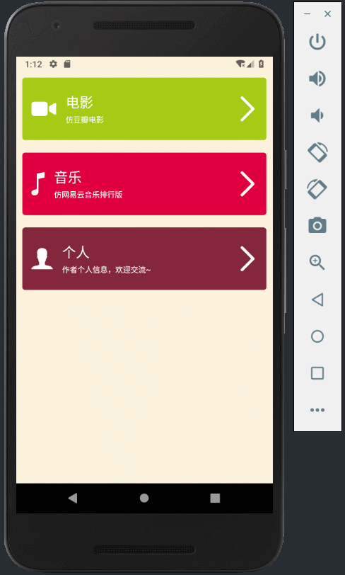

#### 1.该项目是使用react-native编写的，目前为1.0版本，包括豆瓣电影，网易云音乐排行榜，个人模块三部分，由于没有mac，只支持android，持续更新中。

#### 2. 豆瓣电影的UI是参考：https://github.com/mochixuan/Mung

#### 3. 项目集成的功能：

（1）音乐播放器（包含歌词模式）。

（2）友盟集成微信，QQ，钉钉分享。

（3）轮播图。

（4）图片保存至本地相册。

（5）realm数据库和redux。

#### **4.关于分享：**

第三方分享需要自己去各个平台注册开发者账号和app相关信息，然后把得到的appid和appkey配置在mainApplication.java下。

#### 5.项目使用的第三方库：

​    react-native-elements:  一款react-native ui库,

​    react-native-extra-dimensions-android:  android设备宽高度参数,

​    react-native-fs:  缓存文件,

​    react-native-image-zoom-viewer: 图片轮播图，保存等,

​    react-native-linear-gradient:  背景渐变,

​    react-native-shadow:  android阴影,

​    react-native-star-rating: 星星评分器,

​    react-native-svg: 支持svg,

​    react-native-swiper: 轮播图,

​    react-native-vector-icons: 第三方icon,

​    react-native-video: 视频播放器,

​    react-navigation: navigator导航,

​    realm: 数据库

​    react-redux和redux

#### 6.其它：

（1）realm数据库可能需要node>10，若安装报错，可尝试升级或者查看官方issue。

（2）apk下载地址：


## Show Cases

**Swiper image**


**Zoom while sliding**



**Swipe down**


## Getting Started

### Installation

```bash
npm i

react-native run-android
```


### Dependence

Depend on Mung: https://github.com/mochixuan/Mung
